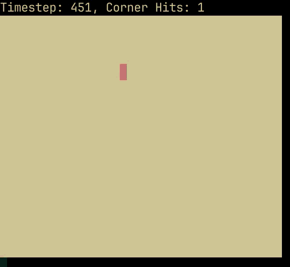
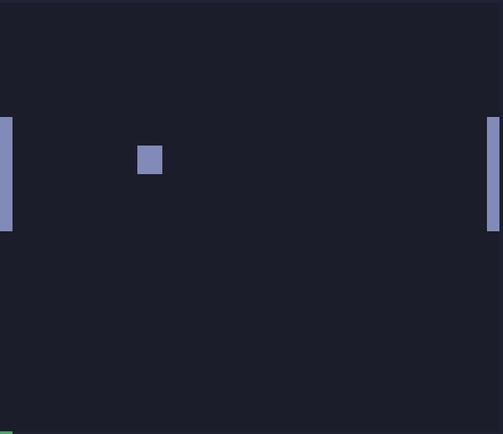

# ArtSI 
ArtSI is a python module for drawing in the terminal using [ansi escape codes](https://gist.github.com/fnky/458719343aabd01cfb17a3a4f7296797).

# Installation:
`pip install artsi` or `uv add artsi`
> [!NOTE]
> If you aren't already using [uv](https://docs.astral.sh/uv/) for your python projects you should try it.


# Getting Started:
ANSI escape codes are special characters that many terminal emulators support which change things like the position of the cursor and the color being drawn.  

ArtSI abstracts the actual codes away when using the `Canvas` class. when drawing with ArtSI is the Canvas class. You can set it's background color and draw rectangles on it.

```py
# Rectangle Drawing
from artsi import Canvas

Canvas.clear()
Canvas.set_background_color("blue")
Canvas.draw_rectangle(1, 1, 3, 4, "white")
Canvas.show(home_=False)
```


Coordinates are (x, y) and the origin (0, 0) is located at the top left of the Canvas.
> [!NOTE]
> Points on the Canvas are rectangles which are roughly twice as tall as they are wide. This is because the Canvas lives on the terminal and characters are that shape.

## Animations
With a bit of creativity and a loop you can also make animations with ArtSI.  
A bouncing rectangle animation is included which also counts how often the rectangle hits a corner as it runs.

```py
# ArtSI hello world
from artsi import Canvas

Canvas.hello_canvas()
```



## Games
It is also possible to make games with ArtSI as your display framework. I've made a few games like pong and snake this way using [pynput](https://pypi.org/project/pynput/)   to handle keyboard input.



# Drawing 
Currently rectangles are the only thing you can draw. It is of course possible to make other shapes by layering these on top of each other but that is left as an exercise for the reader.

## Supported Colors
ArtSI currently uses the most basic 8-16 color terminal codes. These are defined by your terminal but the names are:
`black, red, green, yellow, blue, magenta, cyan, white, default`.  

## API Reference

### Color Codes
```py
Colors.get_code(color_: str, bg_: bool = True) -> str
"""given the name of a color, returns it's escape code"""
```

### Special Characters
```py
Special.reset() -> str
"""returns the reset escape code"""

Special.home() -> str
"""returns the home escape code"""

Special.clear() -> str
"""returns the clear escape code"""
```

### Canvas
```py
Canvas.clear() -> None
"""clears the terminal and homes the cursor"""

Canvas.reset() -> None
"""resets the internal data of the Canvas"""

Canvas.set_background_color(color_: str) -> None
"""changes the background color of the Canvas given the name of a color"""

Canvas.get_shape() -> tuple[int, int]
"""returns the current width and height of the Canvas"""

Canvas.get_width() -> int
"""returns the current width of the Canvas"""

Canvas.get_height() -> int
"""returns the current height of the Canvas"""

Canvas.set_width(new_width_: int) -> None
"""sets the width of the Canvas"""

Canvas.set_height(new_height_: int) -> None
"""sets the height of the Canvas"""

Canvas.draw_rectangle(x_: float, y_: float, width_: int, height_: int, color_: str = "red") -> None
"""marks the cells of the Canvas's buffer with the given color at the given rectangle area"""

Canvas.show(home_: bool = True) -> None
"""converts the Canvas's buffer into a printable string and displays it in the terminal"""

Canvas.hello_canvas() -> None
"""runs the demo bouncing box animation"""
```

# Contribution:
If you would like to see features added feel free to fork the repo or reach out over email.