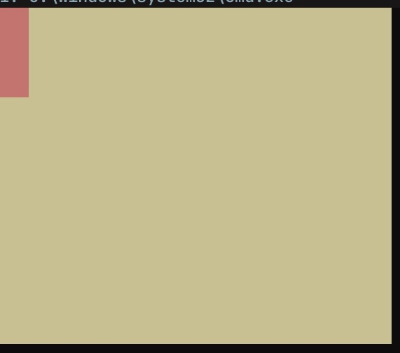
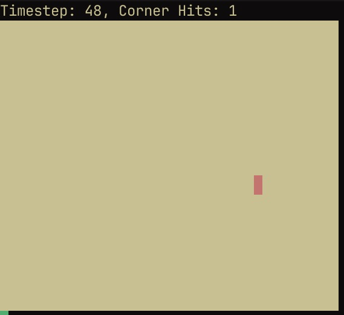

# ArtSI | Drawing In The Terminal With ANSI Escape Codes
A python module for drawing in the terminal using ansi escape codes

ArtSI is purely an interface for drawing in the terminal. The keyboard input wrapper is a seprate thing so it should not be included as a package dependancy when this is published.

# Basic Usage
The main class you will use to draw with ArtSI is the Canvas class. You can set it's background color and draw rectangles with it.

```py
# Rectangle Drawing
from artsi import Canvas

Canvas.clear()
Canvas.draw_rectangle(0, 0, 3, 4)
Canvas.show(home_=False)
```



With a bit of creativity and a loop you can also make animations with ArtSI. A bouncing rectangle animation is included.
  > This script also counts how often the rectangle hits a corner as it runs
```py
# ArtSI hello world
from artsi import Canvas

Canvas.hello_canvas()
```




# Ideas/Concepts
You have a Canvas that you are drawing on. You can draw colored rectangles. All of this is displayed using ANSI escape codes in the terminal.  
You can make little animations with this and also when combined with keyboard input from something like pynput you can make little games too.

# Concepts
## Canvas API

# Todo:
- [ ] make artsi documentation
  - [ ] list colors
  - [ ] add a method to list supported colors
- [ ] release artsi as a python package on pypi
  - [x] finalize api
  - [x] format files as package
    - [x] follow the guide
    - [ ] take notes
- [ ] add some screenshots pictures to this readme
  - [ ] hello canvas
  - [ ] hello rectangle
  - [ ] some sort of pretty scene
- [ ] ...


# Getters for constants?
For consistancy I made getters for the colors/special constants but might wanna switch those to attribute lookups bc there's absolutely no reason to create an entire stack frame.
